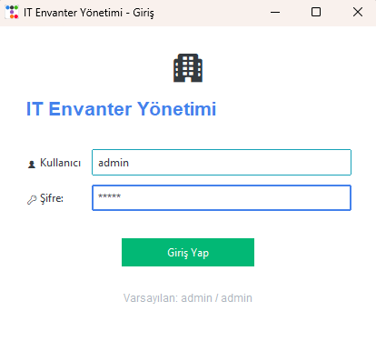
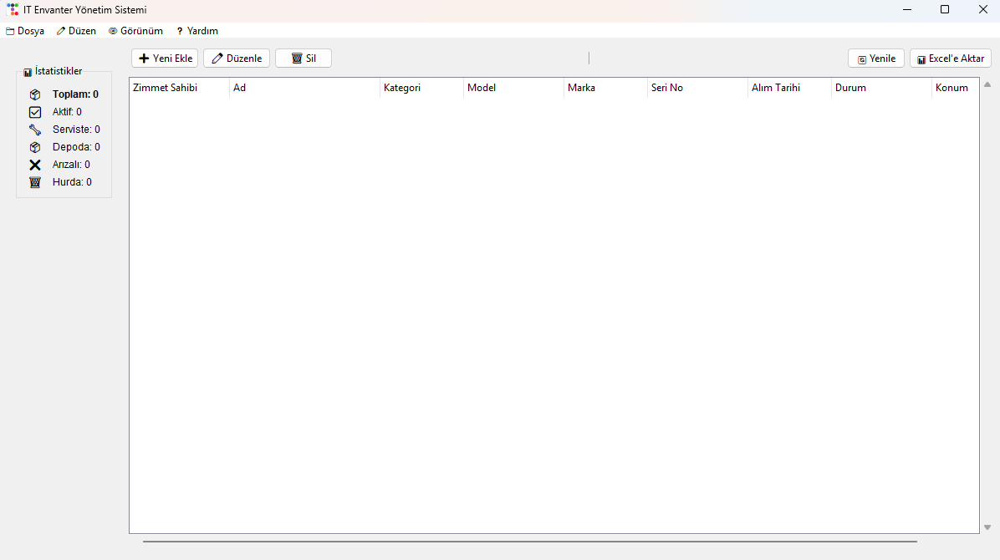
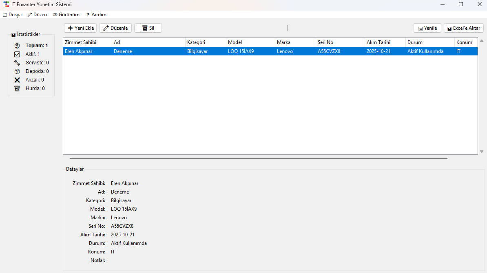
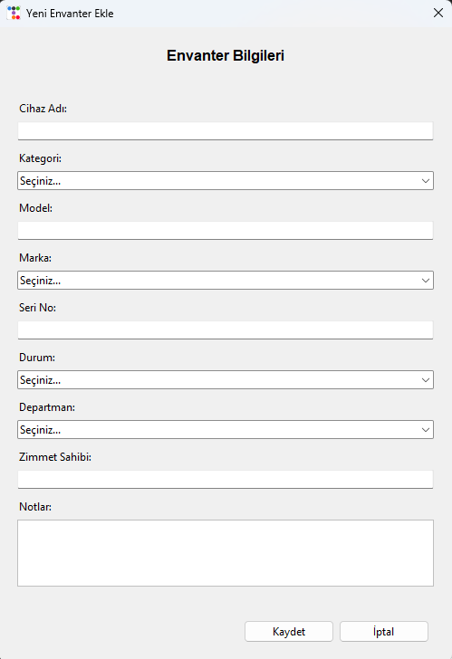

# IT Envanter Yönetim Sistemi

**Sürüm 1.0** 

`Tkinter` ve `ttkbootstrap` kullanılarak geliştirilmiş, yönetici/kullanıcı rollerine sahip, modern bir BT Envanter Yönetim Uygulaması.


## Ekran Görüntüleri

İşte uygulamamızdan birkaç görsel örnek:

### Giriş Ekranı
<p align="center">
  
  <br>
  <em>Kullanıcı kimlik doğrulaması için giriş penceresi.</em>
</p>

### Ana Envanter Penceresi (Boş)
<p align="center">
  
  <br>
  <em>Uygulamanın ilk açılışta boş hali ve istatistik paneli.</em>
</p>

### Ana Envanter Penceresi (Dolu)
<p align="center">
  
  <br>
  <em>Envanterin listelendiği ana pencere.</em>
</p>

### Yeni Kayıt Ekleme
<p align="center">
  
  <br>
  <em>Yeni bir envanter öğesi eklemek için kullanılan diyalog kutusu.</em>
</p>

## Özellikler

- **Modern Arayüz:** `ttkbootstrap` kütüphanesi ile temalı (`litera` teması) ve duyarlı (`grid` layout) kullanıcı arayüzü.
- **Kullanıcı Yetkilendirme Altyapısı:**
    - **Admin:** Envanter ekleyebilir, düzenleyebilir ve silebilir.
    - **User (Gelecek Sürümlerde):** Veritabanına 'user' rolüyle eklenecek kullanıcılar, envanteri sadece görüntüleyebilir (değişiklik butonları devre dışı kalır).
- **Envanter İşlemleri (CRUD):**
    - Envanter listeleme ve detay görme.
    - Yeni envanter kaydı ekleme (Admin).
    - Mevcut kayıtları düzenleme (Admin).
    - Tekli veya çoklu seçerek kayıt silme (Admin).
- **Veritabanı:** Basit ve taşınabilir `SQLite` veritabanı desteği.
- **Ek Özellikler:**
    - **Doğal Sıralama:** Tablo başlıklarına tıklayarak akıllı sıralama.
    - **İstatistik Paneli:** Cihazların durumuna (Aktif, Depoda, Serviste, Arızalı, Hurda) göre anlık sayaçlar.
    - **Excel'e Aktarma:** Mevcut envanter listesini (`.xlsx` formatında) dışa aktarma (`pandas` ve `openpyxl` gerektirir).

## Kurulum

1.  (Önerilir) Bir sanal ortam (`venv`) oluşturun ve aktive edin:
    ```bash
    python -m venv .venv
    .\.venv\Scripts\activate
    ```

2.  Gerekli Python paketlerini (`pandas`, `ttkbootstrap` ve `openpyxl`) `requirements.txt` dosyasından yükleyin:
    ```bash
    pip install -r requirements.txt
    ```

3.  Uygulamayı projenin ana dizininden (örn: `IT Envanter Uygulaması`) modül olarak başlatın:
    ```bash
    python -m src.main
    ```

## Kullanım

1.  Uygulama başlatıldığında giriş ekranı açılacaktır.
2.  Varsayılan yönetici hesabı (`admin` / `admin`) ile giriş yapın.
3.  Giriş yapan kullanıcının rolü "admin" olduğu için, "Yeni Ekle", "Düzenle" ve "Sil" butonları aktif olacaktır.
4.  Listeyi sıralamak için sütun başlıklarına tıklayın.
5.  Tüm listeyi Excel'e aktarmak için "Excel'e Aktar" butonunu kullanın.

## Geliştirme

Proje, arayüz (`views`) ve ana mantığı ayırmaya çalışarak geliştirilmiştir:

- `src/main.py`: Uygulamanın ana giriş noktası, veritabanını kurar ve `LoginWindow`'u başlatır.
- `src/views/login.py`: Giriş ekranı arayüzü ve mantığı.
- `src/views/main_window.py`: Ana envanter ekranı (`MainWindow`) ve dialog pencereleri (`InventoryDialog` vb.)

